# PAP21L-Z01

## Zespół Z01

- Igor Kraszewski
- Krystian Grela
- Mateusz Gurdała

## Tematyka

Desktopowa przeglądarka graficzna z możliwością tagowania zdjęć oraz tworzenia prywatnych grup ze zdjęciami tylko dla wybranych użytkowników.  Do tworzenia kont, zarządzania nimi oraz zarządzania grupami służy aplikacja webowa.

## Technologie

- .NET/WPF
- Python/Django
- CSS/HTML/JS
- SQLite
- RestAPI
- Baza postgreSQL stworzona na Heroku

## Możliwości

- Pobieranie aplikacji desktopowej ze strony internetowej
- Udostępnianie zdjęć między użytkownikami
- Grupowanie i tagowanie zdjęć, powiązana z tym wyszukiwarka
- Tworzenie grup, dodwania do nich zdjęć i użytkowników (Albumy online)
- Aplikacja desktopowa zgodna z konwencją MVVM, a webowa z konwecją MVT

## Projekt Aplikacji

### Diagram Warstw
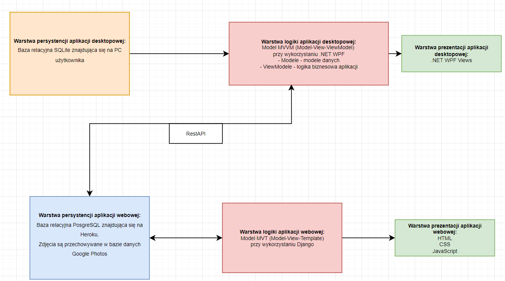

### Schemat aplikacji i jej działanie
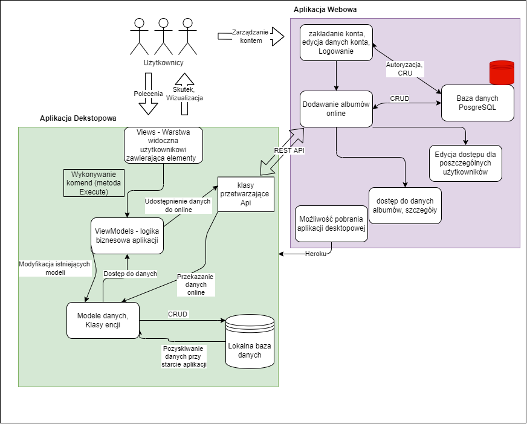

### Relacje encji w bazie danych SQLite

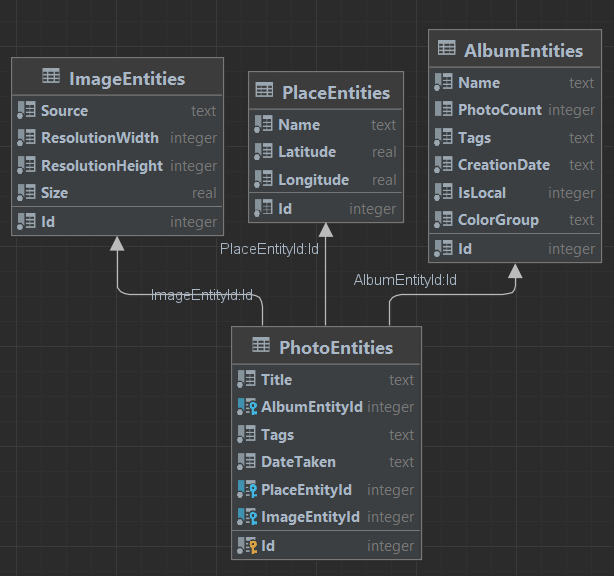

### Relacje encji w bazie danych PostreSQL - Django

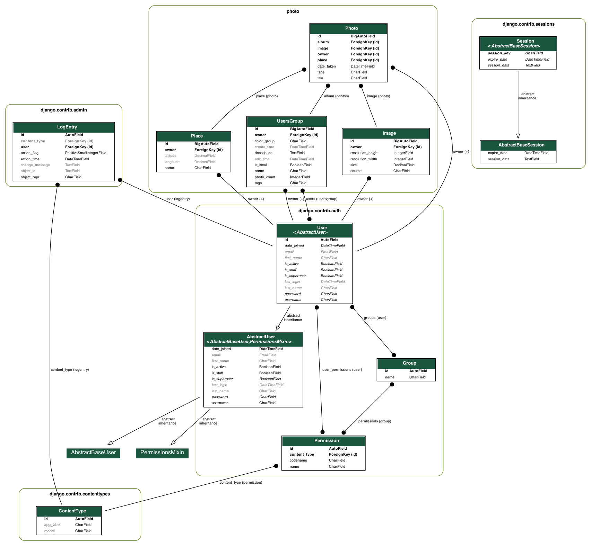

## Aplikacja desktopowa

### Uruchomienie

Do działania aplikacji wymagane są następujące Nuget Packages:
- Microsoft.EntityFrameworkCore 6.0.4
- Microsoft.EntityFrameworkCore.Sqlite 6.0.4
- Microsoft.EntityFrameworkCore.Tools 6.0.4
- Microsoft.Xaml.Behaviors.Wpf 1.1.39
- GMap.NET.Core
- GMap.NET.WinPresentation
- Google.Apis.Drive.v3

Przed zbudowaniem aplikacji (najlepiej w Microsoft Visual Studio)
należy w package manager console wpisać update-database
w celu zainicjalizowania bazy zdalnej na swoim komputerze  

Aplikacje można włączyć za pomomocą pliku .exe znajdującego się pod podaną ścieżką repozytorium:
iPhoto\bin\Debug\net6.0-windows\iPhoto.exe

### Podstawowe Funkcjonalności Aplikacji desktopowej

Program dzieli się na podstrony oznaczone odpowiednimi ikonami:

- Strona startowa - strona witająca użytkownia

- Albumy - strona zawierająca listę albumów, użytkownik może dodawać albumy z wybraną przez
        siebie nazwą i kolorem. Albumy można edytować i usuwać po utworzeniu. Album wyświetla
        informacje o ilości zdjęć, rozmiarze i hashtagach jakie posiadają zdjęcia wewnątrz albumu.
        Zawartość albumu posiada taką samą funkcjonalność jak wyszukiwarka zdjęć opisania poniżej
        z tą różnicą że wyszukiwanie występuje w obrębie albumu.

- Wyszukiwarka zdjęć - główny element naszej aplikacji desktopowej. Odpowiada za CRUD zdjęć.
        Do dodania zdjęć do lokalnej bazy danych służy przycisk kartki z plusem
        znajdująca się w prawym górnym rogu ekranu. W celu wypisania wszystkich zdjęć
        należy w polu *Title wpisać %ALL i nacisnąć przyicsk lupy powyżej.
        Powiekszyć zdjęcie można poprzez podwójne naciśnięcie na zdjęcie.
        Po kliknięciu przycisku listy w prawym górnym rogu i wybraniu zdjęcia jest możliwość
        sprawdzenia szczegółów zdjęcia. Kliknięcie prawym przyciskiem na zdjęcie umożliwia
        zmianę szczegółów zdjęcia lub jego usunięcie. Z prawej strony można rozwinąć panel odpowiedzialny
        za informowanie użytkownika o szczegółach zdjęcia.

- Miejsca - zawiera mapę na której można tworzyć miejsca w których zostały utworzone miejsca. Każde miejsce
        posiada informacje o ilości zdjęć tam wykonanych. Zmianę widoku z dodawania miejsc do listy miejsc
        można wykonać za pomocą przycisku strzałki w górnej części aplikacji.

- Profil - Zawiera informacje o części online naszej aplikacji. Posiada informacje o albumach stworzonych
        online dla grup użytkowników. Umożliwia też przeniesienie na stronę rejestracji w webowej części
        aplikacji.
  
#### Główne Klasy Aplikacji Desktopowej:

- DatabaseHandler - klasa odpowiedzialna za CRUD bazy lokalnej
- DatabaseContext - klasa konfiguracyjna Bazy danych (EntityFrameworkCore)
- klasy w folderze DataObject - konwersja encji otrzymanych z bazy danych na obiekty wykorzystywane w projekcie
- klasy w folderze Models - modele danych zgodne z konwencją MVVM
- DatabaseApiHandler - obsługa API do uzyskiwania albumów online
- GoogleDriveHandler - wysyłanie/odbiór zdjęć online
- SearchEngine - klasa odpowiedzialna za wyszukiwanie zdjęć ustalonych przez użytkownika
- DataHandler - obsługa ścieżek plików np. ścieżka zdjęcia
##### ViewModels

- AlbumViewModel, PlacesViewModel, SearchViewModel, HomePageViewModel, AccountViewModel -
 klasy zgodne z MVVM odpowiedzialne za logikę biznesową podstron opisanych powyżej,
każda podstrona zawiera pomniejsze klasy odpowiedzialne za logikę biznesową szczegółowych elementów np. listy zdjęć

- MainWindowViewModel - uwtorzenie wszystkich podstawowych viewmodeli

##### Views

- AlbumView, PlacesView, SearchView, HomePageView, AccountView -
 klasy zgodne z MVVM odpowiedzialne za wartwę widoczną użytkownikowi.

 Views wykorzystują głównie kod napisany w XAML. Połączenia z ViewModelami wykonywane są
 za pomocą "DataContext".
 Wszystkie polecenia zadane przez użytkownika przekazywane są do programu przy wykorzystaniu komend
 które posiadają metodę Execute wykonującą rozkaz użytkownika.
 Wszystkie komendy znajdują się w folderze Commands.

Naszą aplikację desktopową inicjalizuje klasa App znajdująca się w pliku App.xaml

## Aplikacja Webowa

### Uruchomienie

W celu uruchomienia aplikacji należy wejść w poniższy link: 
https://iphotos-pap.herokuapp.com 

### Sposób wykonania deploy'a

Prototyp aplikacji został postawiony na platformie churowej [Heroku](https://www.heroku.com).  

Przed udostępnieniem aplikacji należało stworzyć plik requirements.txt zawierający potrzebne biblioteki.  
    `pip freeze > requirements.txt` (w wirtualnym środowisku)  
Jako, że Herku wspiera Django, mogłem skorzystać z biblioteki django-heroku, skorzystałem również z gunicorna, dj-database-url oraz django-environ. 
Django-environ pozwoliło mi stowrzyć część zmiennych w ustawieniach jako zmienne środowiskowe, przez co w kodzie nie są widoczne takie elementy jak na przykład secret_key albo hasło do poczty mailowej. 
Gunicorn jest serwerem WWW możliwym do wykorzystania produkcyjnie. Jego wdrożenie zawarte jest w pliku Procfile. 
Django-heroku zawiera w sobie m.in takie pakiety jak whitenoise czy psycopg2. Pierwszy z nich pozwala na udostępnianie plików statycznych (Js, HTML, CSS) na serwer protokołem HTTP, natomiast drugi pozwala na obsługę PostgreSQL, ponieważ on jest używany na Heroku (W wersji lokalnej, bazowo w django używa się SQLite).  
Dj-database-url pozwala stworzyć odpowiednią konifgurację bazy danych na serwerze odpowiadającą tej lokalnej.  

Po odpowiednich konfiguracjach i zmianach w pliku settings.py należało w terminalu zalogować się do heroku:  
`heroku login`    
Należy wtedy wcisnąć dowolny klawisz i zostaniemy przeniesieni na stronę heroku w celu zalogowania.  
Po zalogowaniu możemy stworzyć naszą aplikację w heroku: 
`heroku create <nazwa_aplikacji>` 
Po stowrzeniu aplikacji możemy zainicializować repozytorium lokale, dodać do niego potrzebne pliki aplikacji, zrobić commit i wrzucić do heroku. 
`git init` 
`git add .` 
`git commit -m <nazwa>` 
`git push heroku master` 
Heroku stworzy na podstawie naszych plików aplikacjie, jeżeli nie napotka błędów wygeneruje się link dizęki, któremu możemy z niej korzystać. Zarządzać aplikacją np. jej zmiennymi środowiskowymi możemy w panelu na stronie internetowej lub poprzez terminal.

### Modele - Encje bazy danych

- UsersGroup - model związany z albumami online
- User - model użytkownika, używany domyślny, dostępny w django
- Place - model opisujący miejsce (miejsce wykonania zdjęcia)
- Image - model dotyczący szczegółów do przetwarzania zdjęcia
- Photo - model dotyczący zdjęć, ich opis, tagowanie, źródło, album
- Dodatkowe modele autoryzacyjne i związane z panelem administratora stworzene przez django

### Dostępne adresy URL

*iphotos-pap.herokuapp.com*

- */download* - strona z możliwością pobrania aplikacji
- */download_app* - url uruchamiające pobieranie aplikacji
- */group/create* - strona odpowiedzialna za tworzenie grupy/albumu online
- */groups* - strona wyświetlająca informacje o wszystkich albumach danego użytkownika
- */groups/\<int:pk\>* - strona z detalicznymi informacjami o albumie o danym id
- */groups/update/\<int:pk\>* - strona z możliwością edycji albumu o danym id
- */groups/\<int:pk\>/delete* - url powodujące usunięcia albumu o danym id
- */users/login_user* - strona służąca do logowania użytkownika
- */users/logout_user - url powodujące wylogowanie użytkownika
- */users/register_user* - strona służąca do zarejestrowania przez użytkownika
- */users/profile* - strona ukazująca informacje o koncie użytkownika
- */users/edit_profile* - strona służąca do zmiany danych konta
- */users/change_password* - strona służąca do zmiany hasła dla konta
- */users/reset_password* - url uruchamiające procedurę restaru hasła

REST API
- */api* - strona wskazująca możliwe url dla api
- */api/login* - część api służąca do logowania użytkownika
- */api/logout* - część api służąca do wylogowania użytkownika
- */api/users* - część api ukazująca informacje o zalogowanym użytkowniku
- */api/groups* - część api zawierająca informacje o albumach, do których ma dostęp zalogowany użytkownik
- */api/places* - część api zawierająca informacje o miejscach, do których ma dostęp zalogowany użytkownik
- */api/images* - część api zawierająca informacje techiczne o zdjęciach, do których ma dostęp zalogowany użytkownik
- */api/photos* - część api zawierająca informacje o zdjęciach, do których ma dostęp zalogowany użytkownik
- */api/groups/\<int:pk\>* - część api zawierająca informacje o albumie o danym id
- */api/places/\<int:pk\>* - część api zawierająca informacje o miejscu o danym id
- */api/images/\<int:pk\>* - część api zawierająca techniczne informacje o zdjęciu o danym id
- */api/photos/\<int:pk\>* - część api zawierająca informacje o zdjęciu o danym id

### Walidacja CSS i HTML

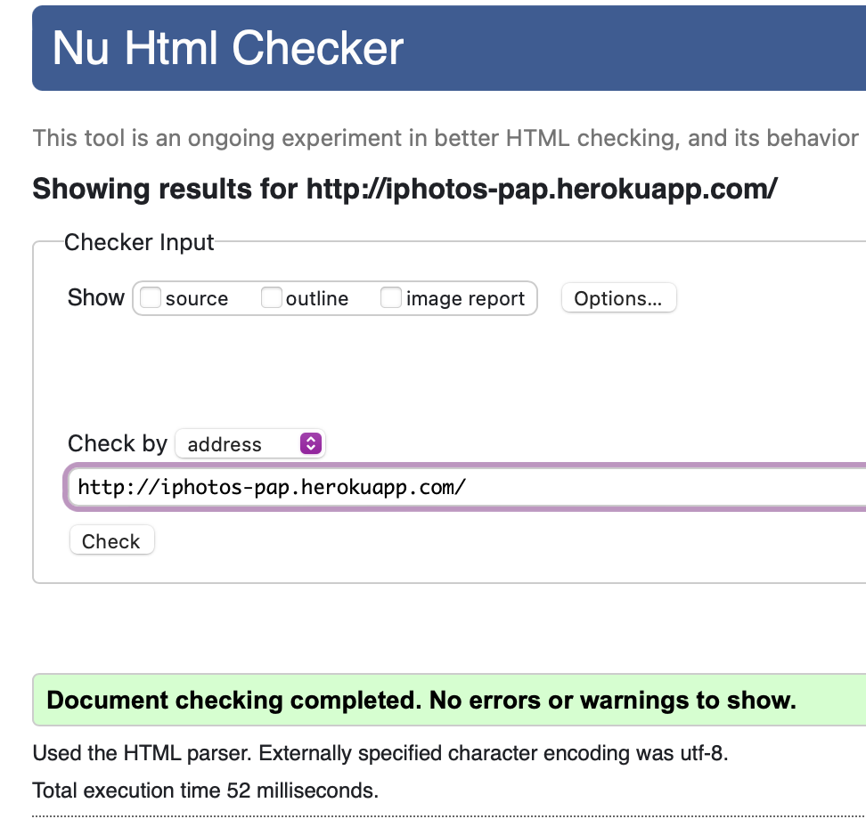

### Funkcjonalność aplikacji webowej

- Konta użytkowników - użytkownik może stworzyc konto podając nazwe użytkownika, imię, nazwisko, adres email oraz hasło, następie musi aktywować konto poprzez link otrzymany w mailu. Posiadając konto, może się na nie logować, zarządzać nim oraz korzystać z dodatkowych funkcjonalności nie dostępnych dla niezalogowanych użytkowników
- Pobieranie aplikacji - aplikacja webowa daje możliwość pobrania aplikacji desktopowej
- Albumy online - w aplikacji można tworzyć, przeglądać, edytować i usuwać albumy online do dzielenia zdjęć z innymi użytkownikami
- Rest api - aplikacja zawiera rest api do komunikacji pomiędzy aplikacją desktopową i aplikacją webową
- Strona startowa - strona startowa prezentuje użytkownikowi możliwości jakie daje aplikacja dektopowa

## Prezentacja

### Aplikacja desktopowa

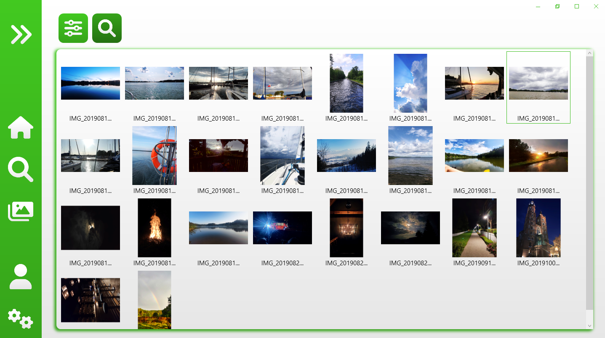
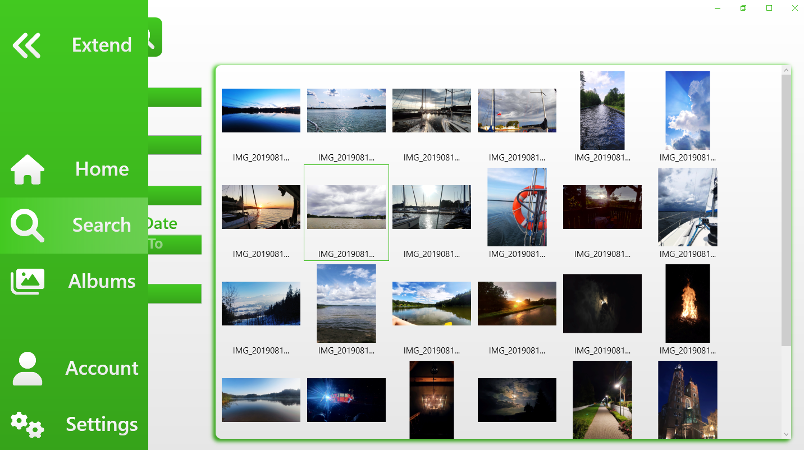
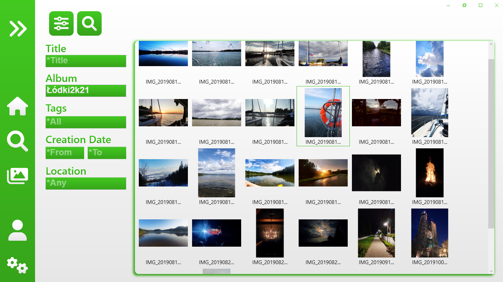
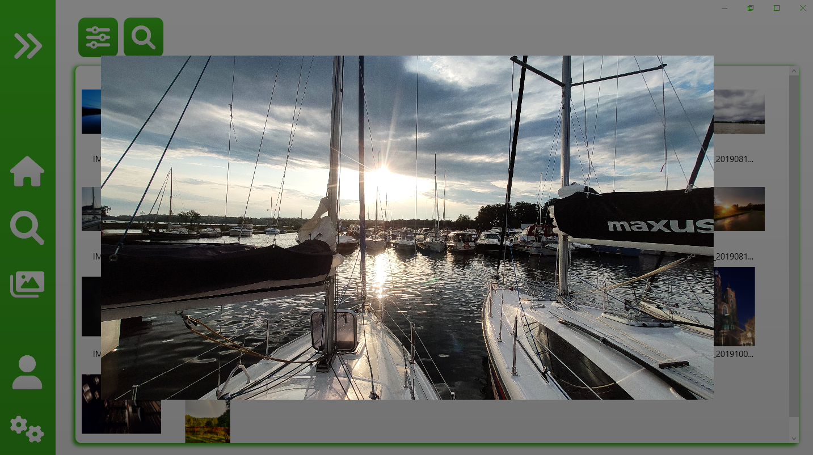

### Aplikacja webowa

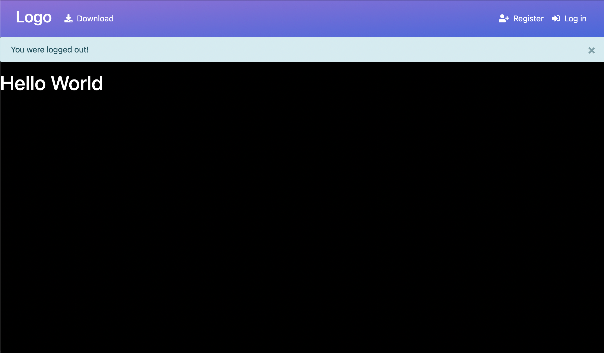
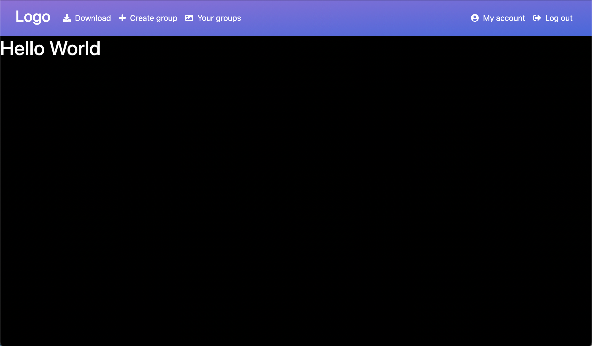
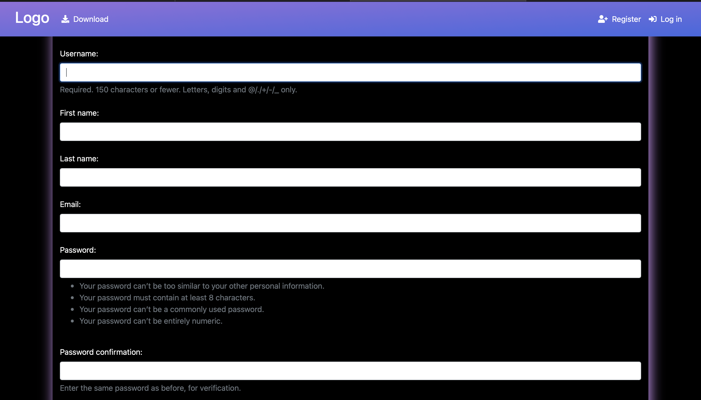
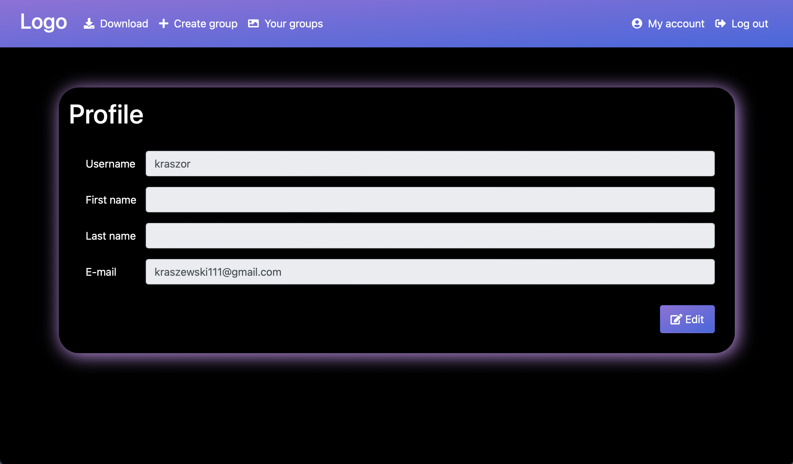
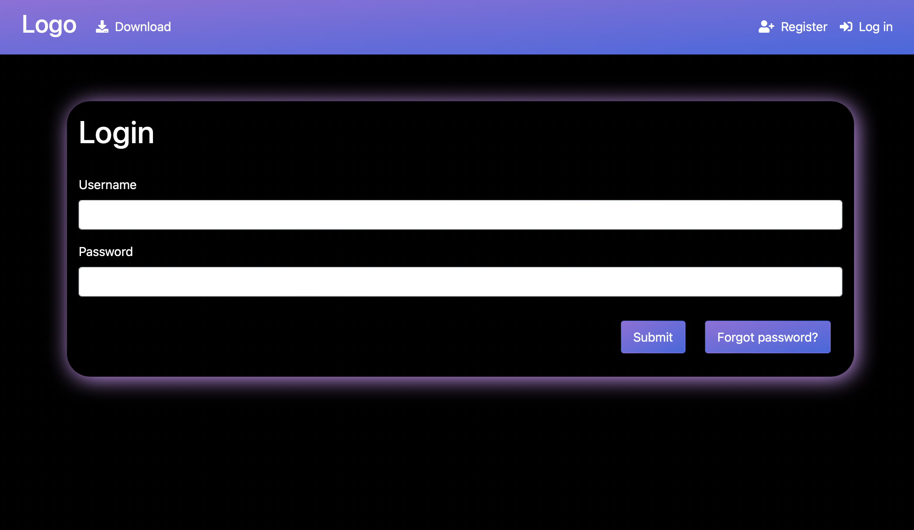
